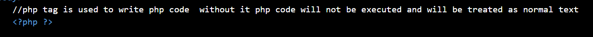
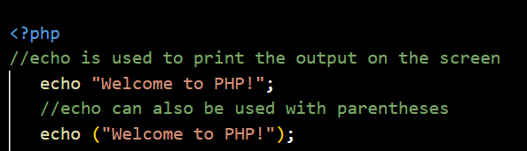
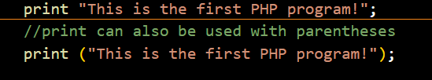
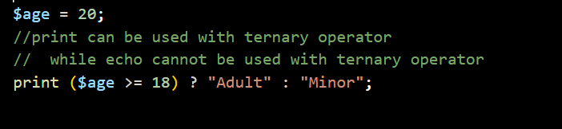
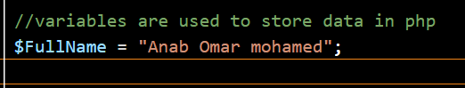

# Week 1

**Status:** Complete

## introduction of php

## 1. What is PHP?
PHP (Hypertext Preprocessor) is a popular server-side scripting language designed for web development. It runs on a server and generates HTML that is sent to the user's web browser.

## 2. What to Write?
PHP code is written inside standard text files using the `.php` extension. and php tag also You can mix PHP code directly with HTML. 


Example (`index.php`):
```php
<!DOCTYPE html>
<html>
<head>
    <title>My First PHP Page</title>
</head>
<body>
    <?php
        echo "Hello, World!";
    ?>
</body>
</html>
```
!
**Important Note:** Without the PHP tags (`<?php` and `?>`), the PHP code **will not work** and will simply display as raw text on your screen

## 3. Where to Write It?
You can use any plain text editor or Integrated Development Environment (IDE) to write PHP code:
* **Editors:** Visual Studio Code, Sublime Text, Notepad++
* **Location:** Place your `.php` files inside your local server's public folder (for example, the `htdocs` folder if you use XAMPP, or `www` if you use WampServer).

## 4. How Can It Be Accessed?
Because PHP requires a server to process the code, you cannot simply double-click the file to open it in a browser. Follow these steps:
1. Start your local server (such as Apache via XAMPP or MAMP).
2. Open your web browser.
3. Type the local URL followed by your file name in the address bar:
eg: localhost/Week1/index.php

## How to print something on the screen of the browser
-- There are two ways :
 1. Echo is used to show the output of the code in the browser
  

 2. Print is also print is used show the output 

 

 paranthesis is optional for two of them

 ## Difference betwen echo and print 
 --Both echo and print are language constructs used to display output on the browser, but they have a few key differences: 

   1.Return Value: print returns an integer value of 1 (meaning it can be used inside complex expressions like a ternary operator),

 

 
 2. whereas echo does not return any value and is slightly faster.   Parameters: echo can accept multiple parameters separated by commas, while print can only take a single argument.
    

## PHP Variable Rules
1.A variable must start with $.
2.It must start with a letter or _ after $.
3.It cannot start with a number.
4.It can contain letters, numbers, and _.
5.It cannot contain spaces.
6.PHP variables are case-sensitive.

The rule of naming convention in php is declaring and initializing at once  

 
  
 this screenshot shows how to create a variables in php


 ## Single vs Double Quotation in PHP

1.Single quotes ' ' treat variables as plain text.

2.Double quotes " " allow variables to be replaced with their values.

3.Double quotes also interpret special characters like \n.

 

 ## strlen() and count() in PHP
 1. strlen() counts the number of characters in a string.

 2. str_word_count() counts the number of words in a string.

  


   


