WEEK 2
status : in progress

## Const variable rules in php

1. variable name must be String only
2. declaring and initializing at one time 
3. const variable will use define() function that will take two arguments which is variable name and it's value.

Here is example of it 

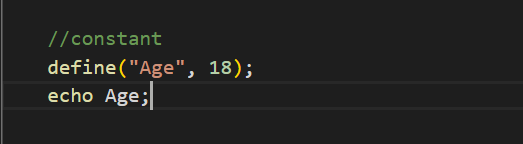

## Control structure

  control structures are classified into three category 

1. sequential structure which goes the same order of the code .
 
    Here is an  example of sequential code

     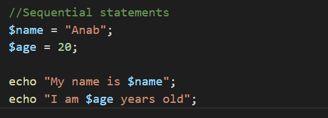

2. Selections ,conditions and decision which executes or skips certain code according a certain cretaria.
 

     Here is an  example of if & else code

     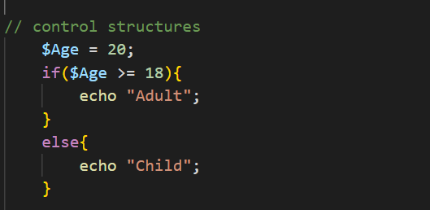

3. Repetitions or loops uses number of repetition according to specified cretaria.

    There are three common types of loops in PHP:

    ### 1. For Loop
    
        A for loop is used when you know how many times you want to repeat a block of code.

    ## When to use:
       When the number of repetitions is known in advance.

     ## Why:
         It provides a simple way to repeat code a specific number of times.

     

     Here is an  examples of forLoop code

     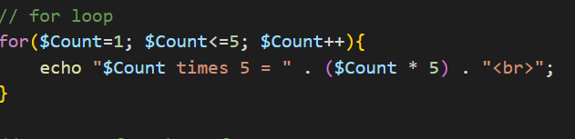

     Here is an  example of Nested for Loop code
     

     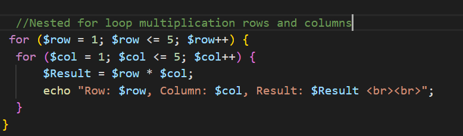 

     another example of Nested forloop  that displays square root numbers

     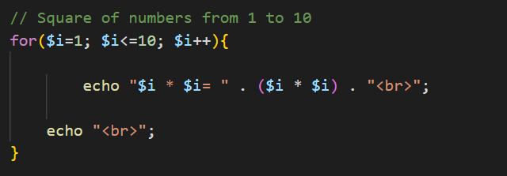

     ## While Loop
         A while loop repeats a block of code as long as a specified condition is true.

     ## When to use:
          When you do not know exactly how many times the loop will run, but you have a condition to check.

     ## Why:
      It allows code to continue executing until a condition becomes false.

     Here is an  example of While-loop code

    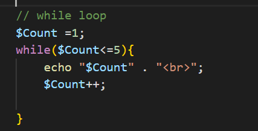

    ## Do-while loop 
        A do-while loop executes a block of code at least once before checking the condition.

     ## When to use:
       When you want the code to execute at least once, regardless of whether the condition is initially true.

     ## Why:
          It guarantees one execution before checking the condition.

          Here is an  example of Do-While loop code

          
    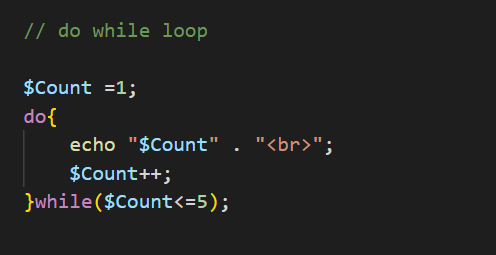

    ## Switch statement
       A switch statement is a selection structure used to execute one block of code from multiple options based on the value of an expression.

    ## When to use:
        When you need to compare one value against multiple possible options.

     ## Why:
        It makes multiple-choice decisions cleaner and easier to read than using many if-else statements.

    
    Here is an  example of switch statement code

    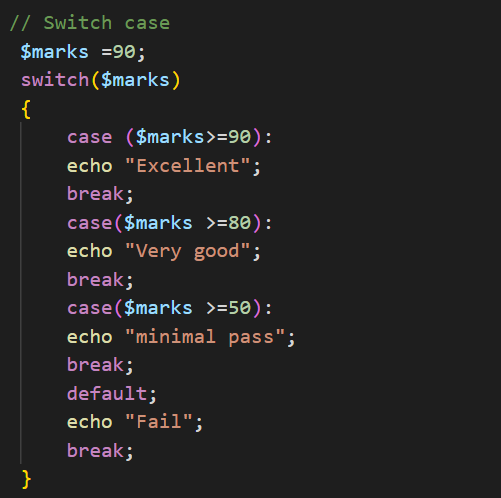

    ## Ternary Operator
       The ternary operator is a short way of writing a simple if-else statement.
       It checks a condition and returns one value if the condition is true and another if it is false.

    ## When to use:
        When you have a simple condition with only two possible results.

    ## Why: 
           It makes short if-else statements more concise.

    Here is an  example of ternary operator code

     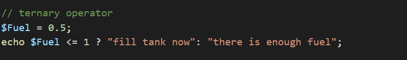

     ## Arrays in php 
         Array is variable that holds multiple values that are mapped by  keys and index 

         instead  of creating each piece of data one by one .

         in php array will be accessed two ways either number or string

    ## Types of array in php are classified into three 

            1. Numerical index array is numeric index arrray and it can be accessed as a linear.
            2. Associative array is a string array that stores values with key and values pairs.
            3. Multidimensional Arrays is array that contain nested arrays inside them .

    
    ## Numerical index array can do two ways:
    creating and initializing at once here is an example of it 
        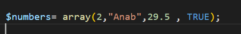

     creating an empty array

    here is example of it 

    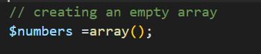

    here is another example of assigning value to index 

    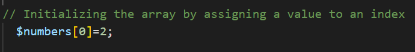

## Associative array can be accessed through the key name 

here is an example of associative array accessing the key name 
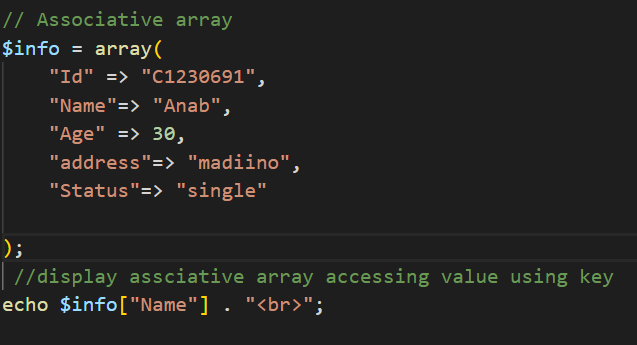

## Here is another example of associative array using forEach to display
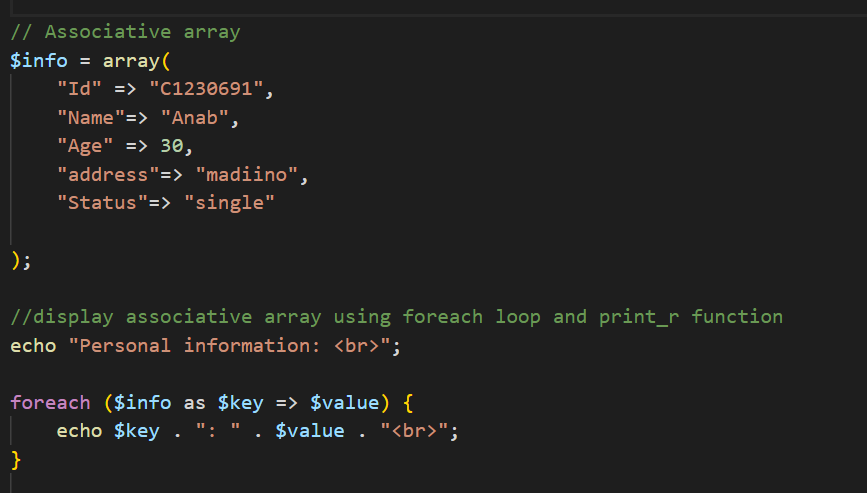

## var_dump() is a PHP function used to display detailed information about a variable.

It shows information such as:

  1. The data type
  2. The value
  3. The length of strings
  4. The number of elements in an array
 5. The indexes and values of an array

    Here is an example of it 

     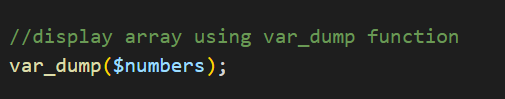

## print_r() 
is used todisplays a more human-readable representation of a variable, especially useful for arrays.  

     Here is an example of it   
         
 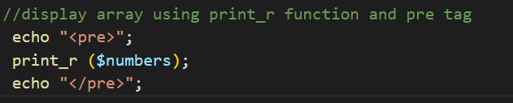

Without pre tag, print_r() output can look messy in a browser.

     
     
## Pre  tag :
is an HTML tag used to preserve spaces, line breaks, and formatting when displaying text in the browser.

The pre  tag can be used with both print_r() and var_dump().

here is examples of it 

   

    

