## Week 3
## Multi-dimensional Arrays and functions using array  

## What is a Multi-Dimensional Array?

A multidimensional array is an array that contains one or more arrays inside it, where values are accessed using multiple indices.

## When is used multi-Dimensional Array ?
Multidimensional arrays are typically used when data is organized in a tabular form.

## Why is it used ?

It is used to store, organize, and manage complex or hierarchical data efficiently by allowing an entire array to be nested inside another recursively, mirroring rows and columns or multi-level data structures.

Here is example of multi-dimensional array

 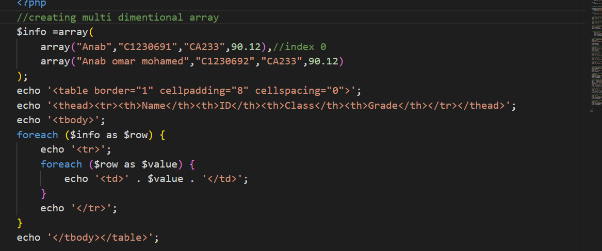

 ## function arrays 
 is used to effectively manipulate and work with arrays, several built-in functions are commonly used:

 ## is_array(): 
 Checks whether a given variable is an array.

 here is an example of it 
 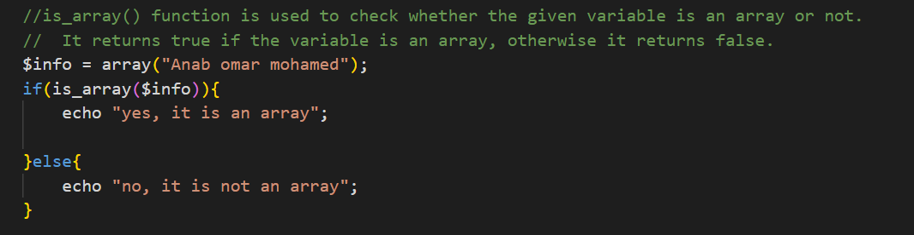

## in_array():
 Checks whether a specified value exists within an array.

  here is an example of it 
 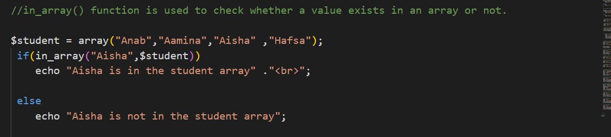

## count() / sizeof(): 
Returns the total number of elements contained in an array.

 here is an example of it 
 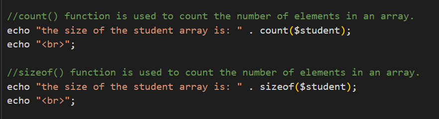

## sort() / rsort():
 Sorts a standard array in ascending or descending order.

  here is an example of it 
 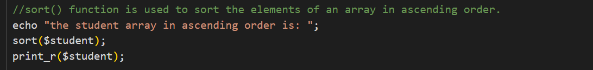
 
 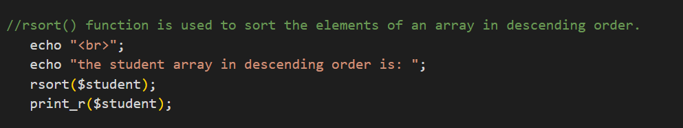

## asort() / arsort():
 Sorts an associative array based on its values while maintaining index association.

  here is an example of it 
 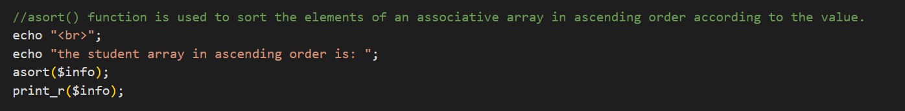
  
 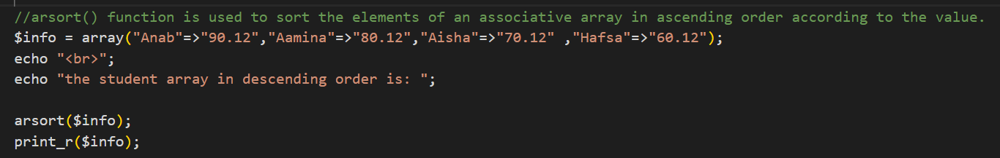

## implode() / explode():
 Converts an array into a single string, or splits a string into an array.

  here is an example of it 
 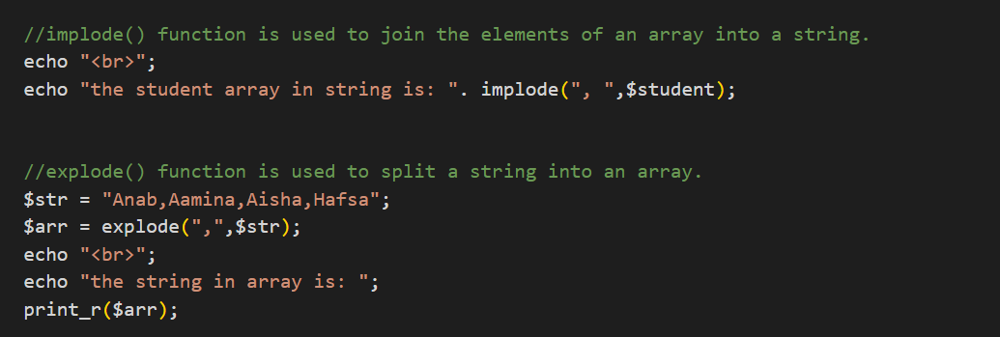

 ## array_merge():
  Merges the elements of one or more arrays together into a single unified array.

  here is an example of it 
 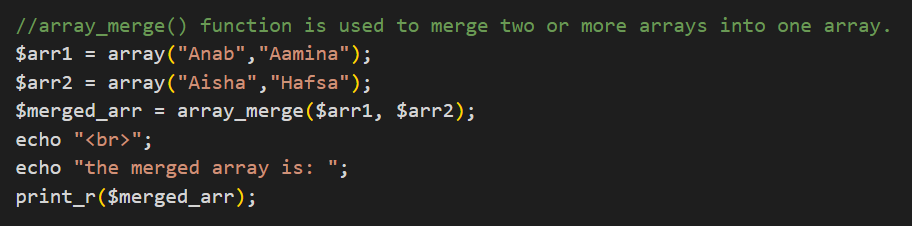

## array_reverse():
 Returns an array with its element order completely reversed.
  here is an example of it 
 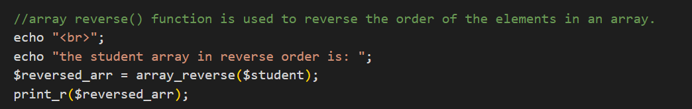
## shuffle():
 Randomly reorders the elements of an array into a randomized sequence.

   here is an example of it 
 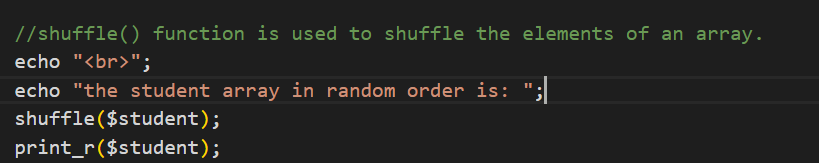

## array_push() / array_pop():
 Adds elements to the end of an array or removes the final element.

  here is an example of it 
 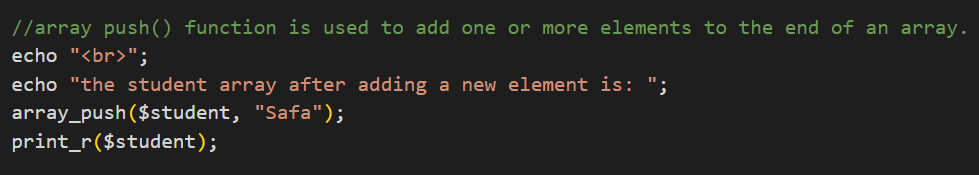
 
 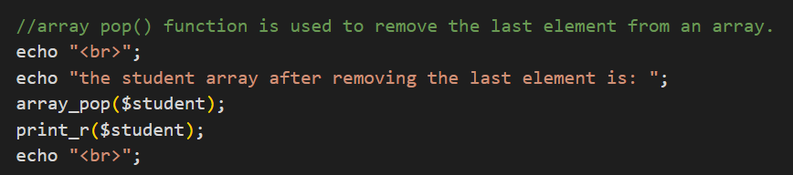

 ## min(): 
 Returns the lowest value present in an array. 
 ## max():

  Returns the highest value present in an array.   

 here is an example of it 
 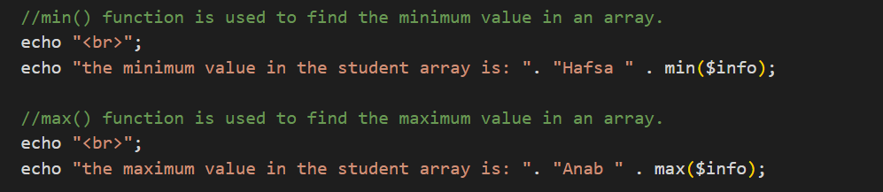
